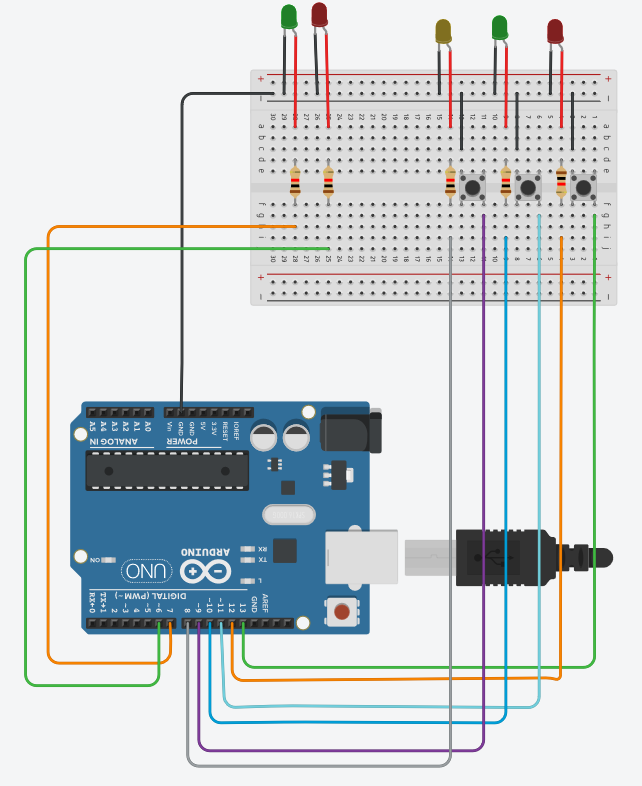
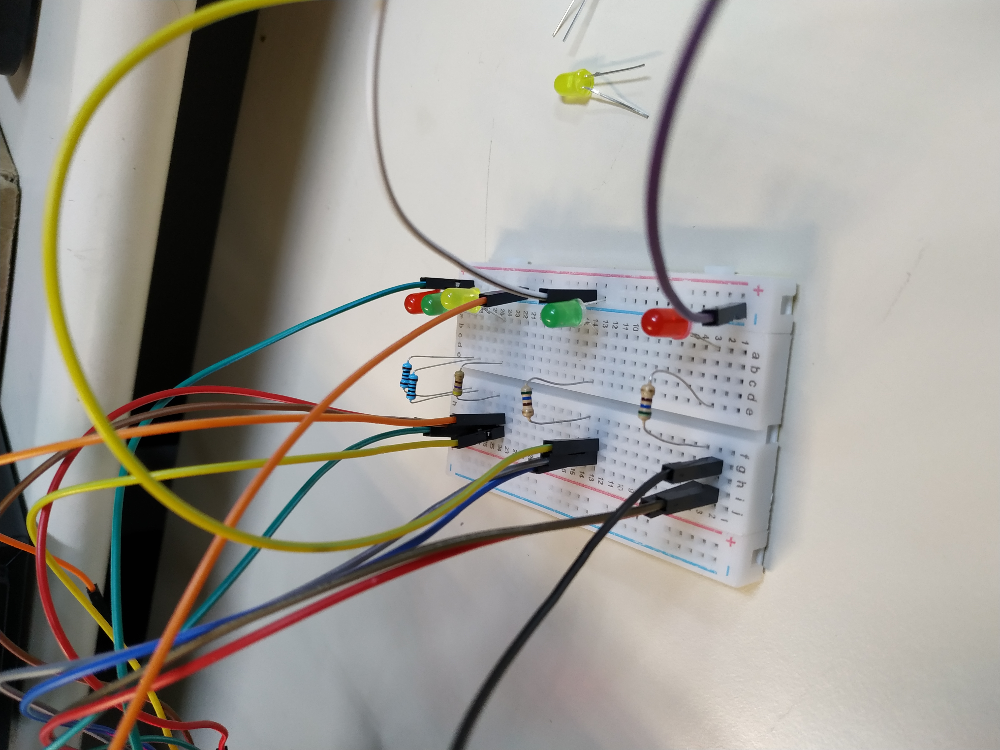

# Simon42

Developed a color memorization game using Arduino, inspired by Genius.

[Simon42 Demo](https://www.youtube.com/watch?v=gmdVykNJX98&feature=youtu.be)

Circuit Simon42 Design    

Circuit Simon42 Real  

---

Project for Computer Electronics (SSC0180) - Computer Science @ Instituto de Ciências Matemáticas e de Computação (ICMC) - Universidade de São Paulo (USP). São Carlos, Brazil, 2019.
